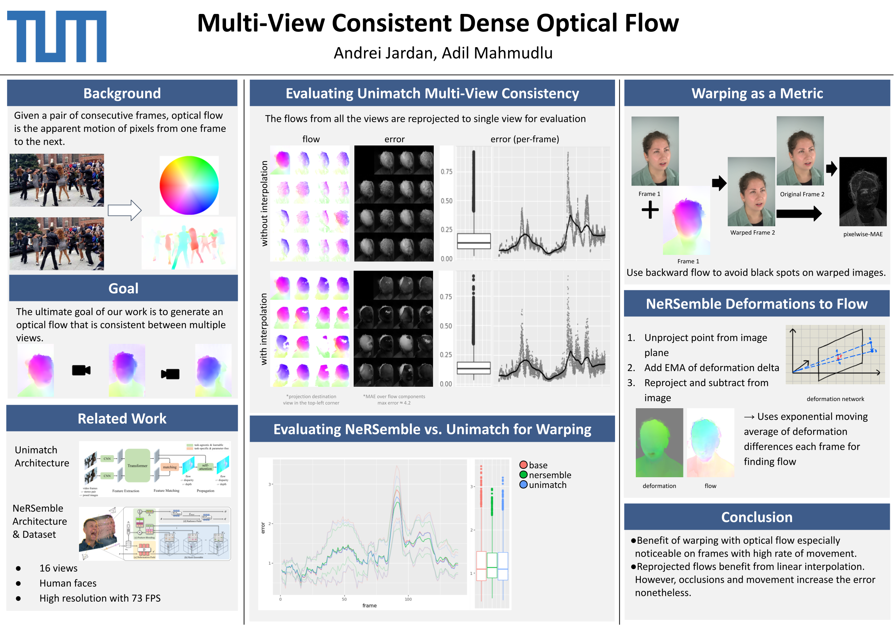

# Multi-View Consistent Dense Optical Flow

> Investigating whether monocular optical flow stays geometrically consistent when the
> same scene is observed from many cameras at once, and how to do better.

A research project ([ADL4CV](https://niessner.github.io/ADL4CV/), TUM) by
**Andrei Jardan** and **Adil Mahmudlu**.

📄 [Read the full report](assets/report.pdf) &nbsp;•&nbsp; 🖼️ [Poster](assets/poster.png)



---

## Motivation

Optical flow i.e. the apparent 2D motion of pixels between two consecutive frames, is a
building block for motion estimation, frame interpolation, and tracking. Modern deep
models (RAFT, Unimatch) are excellent in the **monocular** setting: one camera, one video.

But real capture rigs use **many cameras** looking at the same scene. The same 3D point
projects into every view, so the flows those cameras predict *should* agree once
reprojected into a common frame. Monocular models know nothing about this geometry, so
there is no guarantee they do.

This project asks two questions on multi-view human-head footage from the
[NeRSemble](https://tobias-kirschstein.github.io/nersemble/) dataset (16 views, ~73 FPS):

1. **How multi-view consistent is a state-of-the-art monocular flow model (Unimatch)?**
2. **Can we derive better flow directly from an explicit 3D model**: NeRSemble's learned
   deformation field, and does it warp frames more faithfully?

## Approach

### 1. Measuring multi-view consistency

We run [Unimatch](https://github.com/autonomousvision/unimatch) independently on all 16
views, then **reproject the flow from 15 source views into one destination view** using
per-camera depth and calibration. Most surface points in a source view have no exact
match in the destination, so a dense field requires interpolation: we compare
**binning (no interpolation)** against **linear interpolation** and measure the mean
absolute error (MAE) between the destination's own flow and the reprojected flows.

**Finding:** Unimatch has *some* multi-view consistency, but it degrades noticeably as
scene motion increases. Linear interpolation gives slightly lower error than binning.

### 2. Warping as a quality metric

Lacking ground-truth flow, we evaluate flow by **backward-warping** frame `t` toward
frame `t+1` and measuring the pixel-wise MAE against the real frame `t+1`. Backward flow
is used to avoid holes/black spots in the warped image. The unwarped frame-to-frame error
is the baseline.

### 3. Flow from NeRSemble's deformation field

As an alternative to image-space prediction, we extract flow from an explicit 3D model:

1. Un-project a pixel to a 3D point using camera intrinsics + depth.
2. Add the delta of NeRSemble's deformation network between `t+1` and `t`.
3. Reproject and subtract from the original pixel to get the backward flow vector.

**Finding:** Warping with NeRSemble-derived flow gives the **lowest** error, ahead of
Unimatch, and both beat the no-warp baseline, the gap is largest on high-motion frames.
Interestingly, the Unimatch and NeRSemble flows look strikingly different, which merits
further investigation.

## Key takeaways

- Monocular flow models are **not geometry-aware** and drift out of multi-view consistency
  under motion.
- Deformation-derived flow is **promising** but only as good as the underlying 3D model and
  camera calibration.
- Warping-based evaluation is useful but **doesn't fully capture** cross-view geometric
  consistency: a dedicated multi-view metric is future work, as is jointly estimating
  **3D scene flow** and projecting it into each view.

---

## Repository layout

The pipeline is a set of composable scripts around a shared utilities core.

| Area | Files |
| --- | --- |
| **CLI entry point** | `tool.py` (`./tool <subcommand>`), `tool` wrapper |
| **Flow extraction** | `unimatch_extract_flow.py`, `unimatch_scene_flow.py` |
| **Deformation → flow** | `deformation_to_flow.py`, `deformation_test.py` |
| **Reprojection / multi-view** | `flow_to_view.py`, `color_to_view.py`, `reprojection_error.py`, `avg_interpolate.py` |
| **Warping & error metrics** | `flow_warp_err.py`, `flow_to_err.py`, `flow_to_model.py` |
| **Point clouds / meshes** | `generate_color_pointcloud.py` |
| **Utilities** | `ml_util.py` (flow ↔ image, warping, EXIF), `util.py`, `colab_util.py` |
| **Plotting** | `stats/*.py` (build dataframes + plots of the error distributions) |
| **Visualization helper** | `gridify.py` (assemble image grids like the poster figures) |
| **Notebook** | `main.ipynb` (Colab-friendly driver) |

### Flow visualization

Flow fields are visualized in **HSV**: flow angle → hue, magnitude (rescaled to `[0, 1]`)
→ value, saturation fixed at 1. Generate the reference color wheel with:

```bash
./tool flow_wheel --radius 500
```

## Getting started

The `tool.py` CLI handles setup of the external dependencies (Unimatch, NeRSemble) and
common operations.

```bash
# One-time setup of the Unimatch baseline
./tool unimatch_setup

# Setup NeRSemble data tooling / model
./tool nersemble_data_setup
./tool nersemble_setup

# Run Unimatch on a pair of frames (download a checkpoint from the Unimatch MODEL_ZOO)
./tool unimatch_run image0.png image1.png \
  --checkpoint gmflow-scale1-things.pth \
  --output flow.png --output-warped
```

Other handy subcommands: `flow_warp` (warp an image with a flow), `flow_wheel` (HSV
reference), `img_show`, `vid_diff`. Run `./tool <subcommand> --help` for arguments.

Data paths in the standalone scripts (e.g. `flow_to_view.py`) point at a local NeRSemble
layout. Adjust the `*_PATH` constants at the top of each script to match your data.

> [!TIP]
> If Unimatch appears to hang forever, force single-threaded OpenMP:
> ```bash
> export OMP_NUM_THREADS=1
> ```
> (`tool.py` sets this automatically.)

## Data

Human-head sequences from the **NeRSemble** multi-view dataset (16 synchronized cameras,
high resolution, ~73 FPS). Depth and deformation maps come from a trained NeRSemble model.
Access to the dataset is gated by its authors, see the
[NeRSemble project page](https://tobias-kirschstein.github.io/nersemble/).

## References

- **Unimatch** - Xu et al., *Unifying Flow, Stereo and Depth Estimation*, TPAMI 2023.
- **RAFT** - Teed & Deng, *Recurrent All-Pairs Field Transforms for Optical Flow*, 2020.
- **NeRSemble** - Kirschstein et al., *Multi-view Radiance Field Reconstruction of Human
  Heads*, ACM ToG 2023.
- Schuster et al., *Combining Stereo Disparity and Optical Flow for Basic Scene Flow*, 2018.
- Yang & Ramanan, *Upgrading Optical Flow to 3D Scene Flow through Optical Expansion*, CVPR 2020.

See [`assets/report.pdf`](assets/report.pdf) for the full write-up and figures.
